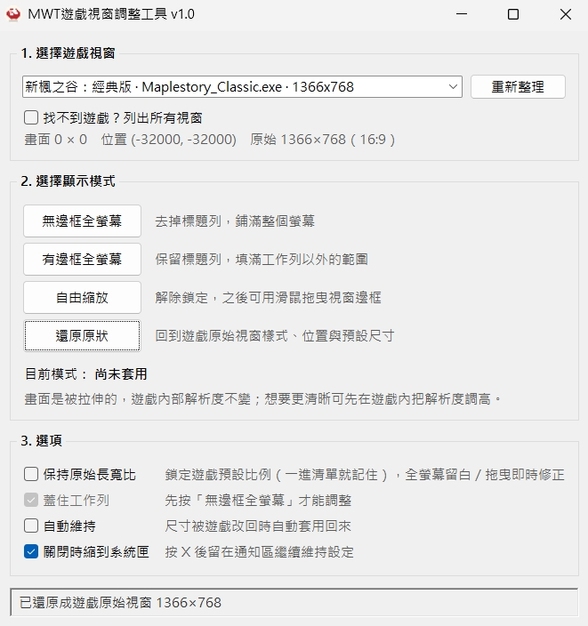

# ＭＷＴ遊戲視窗調整工具

Windows 上用來調整遊戲視窗外觀與尺寸的小工具。可直接下載並執行倉庫根目錄的 [**MWT-1.1.exe**](MWT-1.1.exe)。

## 介面預覽



## 警告與免責

**本工具不是外掛、外掛程式或作弊軟體。** 僅透過 Windows 系統介面調整遊戲視窗外觀與尺寸，不讀寫遊戲記憶體、不修改遊戲檔案、不注入程式碼。

請勿將本工具用於任何違反遊戲服務條款、干擾他人遊戲體驗或其他非法用途。使用本工具即表示您了解並同意：一切風險由使用者自行承擔，作者不對帳號停權、遊戲異常、資料損失或任何衍生後果負責。

## 建議使用順序

1. **先開啟遊戲**，等到遊戲視窗出現。
2. **再開啟本工具**（雙擊 `MWT-1.1.exe`，或用 Python 執行 `mwt.py`）。
3. 在工具中按「重新整理」，選取遊戲視窗後再套用模式。

若先開工具後再開遊戲，清單可能暫時找不到目標；此時重新整理即可。

## 系統需求

- Windows
- 一般使用：`MWT-1.1.exe`（免安裝）
- 從原始碼執行：Python 3（標準庫即可，無需額外套件）

## 功能概覽

- **無邊框全螢幕**：去掉標題列，鋪滿螢幕（可選擇是否蓋住工作列）
- **有邊框全螢幕**：保留標題列，填滿工作列以外的範圍
- **自由縮放**：解除鎖定，可用滑鼠拖曳視窗邊框調整大小
- **還原原狀**：回到工具第一次看到該視窗時的樣式、位置與尺寸
- **保持原始長寬比**：依遊戲預設比例鎖定，避免畫面被不當拉伸比例
- **自動維持**：尺寸被遊戲改回時自動再套用
- **關閉時縮到系統匣**：按關閉後可留在通知區繼續維持設定

畫面被放大時，遊戲內部解析度通常不會跟著提高；若想更清晰，請先在遊戲內把解析度調高。

## 使用說明

1. 依上方順序先開遊戲，再開本工具。
2. 在「選擇遊戲視窗」中挑目標；找不到時可勾選「列出所有視窗」，或按「重新整理」。
3. 在「選擇顯示模式」中按一個按鈕套用。
4. 依需要勾選「保持原始長寬比」「蓋住工作列」「自動維持」等選項。
5. 若勾選「關閉時縮到系統匣」，按視窗 X 後會留在通知區；雙擊圖示可開回視窗，右鍵可結束。

## 從原始碼執行

```text
python mwt.py
```

請在 Windows 上執行；圖示檔位於 `assets/mushroom.ico`。
